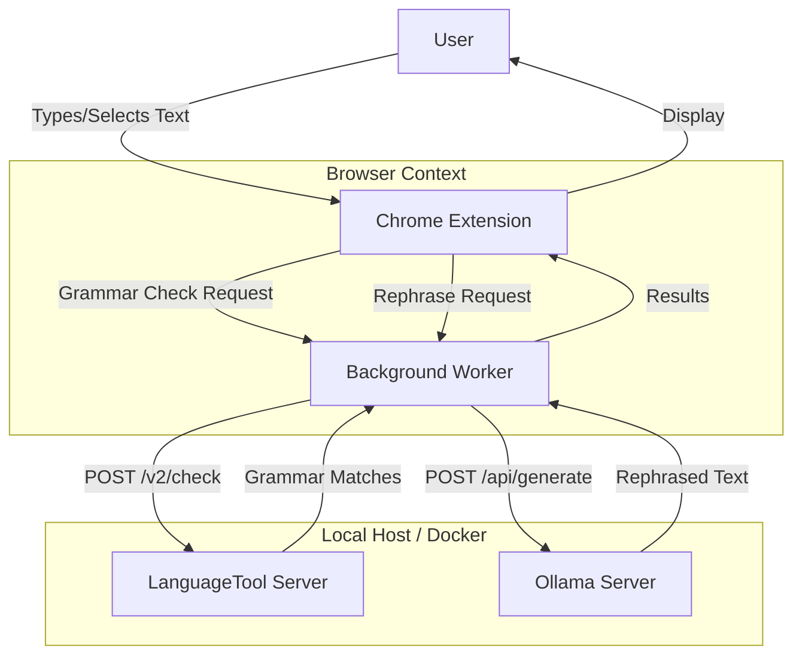

# System Architecture

The AI Grammar Pro+ extension operates on a local-first architecture to ensure privacy and speed. It connects a browser-based frontend with local AI services running in Docker containers.

## High-Level Data Flow

## Component Details

### 1. Chrome Extension (Frontend)
-   **Manifest V3**: Uses the latest Chrome extension standard.
-   **Content Scripts**: Inject UI elements (popups, underlines) into web pages.
-   **Background Service Worker**: Handles communication between the content scripts and the local backend APIs. It manages configuration and caching.

### 2. LanguageTool Server (Grammar Backend)
-   **Container**: `meyay/languagetool`
-   **Port**: `8010`
-   **Function**: Processes text providing grammar, spelling, and style corrections based on the active language.
-   **Data**: Uses local n-gram data (mounted via volume) for improved accuracy.

### 3. Ollama Server (AI Backend)
-   **Container**: `ollama/ollama`
-   **Port**: `30068`
-   **Model**: `llama3.2:1b` (optimized for speed and low latency).
-   **Function**: Generates stylistic rewrites (e.g., "Professional", "Casual") based on prompts sent by the extension.
